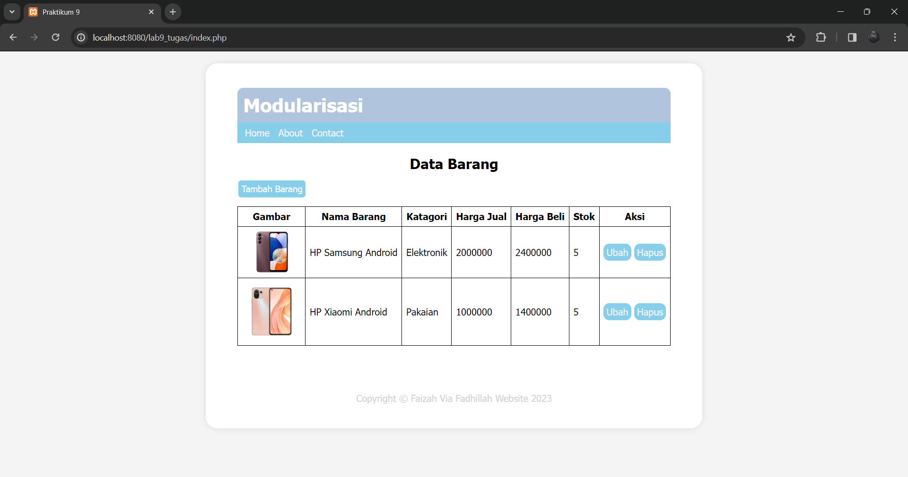
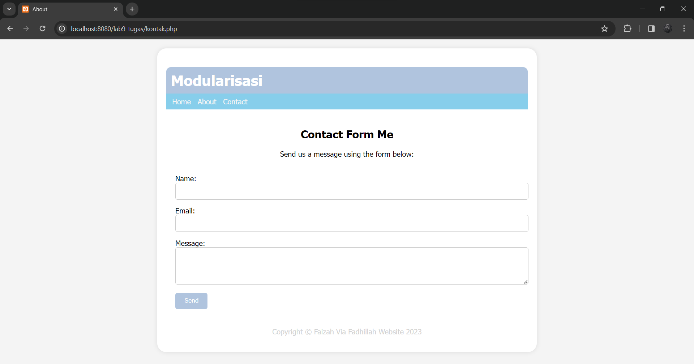
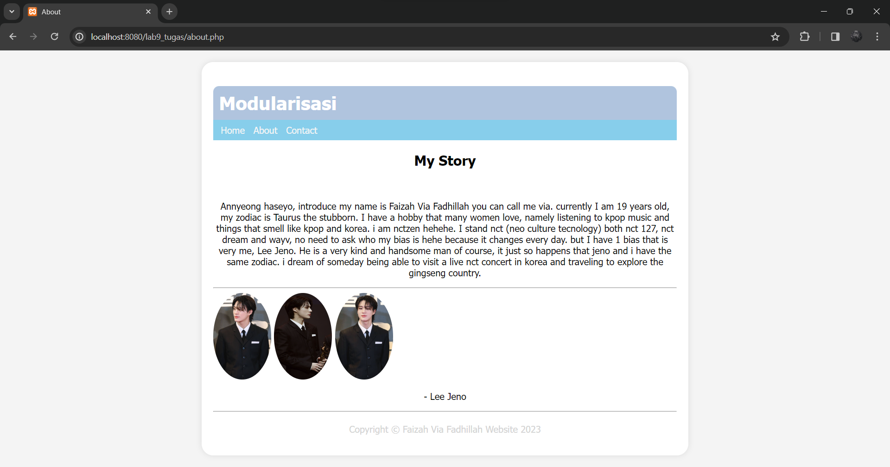

`Nama  : Faizah Via Fadhillah`

`Nim   : 312210460`

`Kelas : TI22.A4`


# Praktikum 9

1. Persiapan

    Untuk memulai membuat aplikasi `CRUD` sederhana, yang perlu disiapkan adalah database server menggunakan `MySQL`. 
    Pastikan `MySQL` Server sudah dapat dijalankan melalui `XAMPP`.


2. Buat file baru dengan nama `header.php`

Script :

```html
<h1>Modularisasi</h1>
    <nav>
        <a href="home.php">Home</a>
        <a href="about.php">Tentang</a>
        <a href="kontak.php">Kontak</a>
        <a href="index.php">Data Barang</a>
    </nav>
```


3. Buat file baru dengan nama `footer.php`

Script :

```html
<footer>
    <p>&copy; 2021, Informatika, Universitas Pelita Bangsa</p>
</footer>
```


4. Buat file baru dengan nama `home.php`

Script :

 ```php
<?php require('header.php'); ?>
    <div class="content">
    Modul Praktikum Pemrograman Web Agung Nugroho (agung@pelitabangsa.ac.id) 78 Universitas Pelita Bangsa, Bekasi
        <h2>Ini Halaman Home</h2>
        <p>Ini adalah bagian content dari halaman.</p>
    </div>
<?php require('footer.php'); ?
```


5. Buat file baru dengan nama `about.php`

Script :

```php
<?php require('header.php'); ?>
    <div class="content">
        <h2>Ini Halaman About</h2>
        <p>Ini adalah bagian content dari halaman.</p>
    </div>
<?php require('footer.php'); ?>
```


6. Buat file baru dengan nama `kontak.php`

Script :

 ```php
<?php require('header.php'); ?>
    <div class="content">
        <h2>Ini Halaman Kontak</h2>
        <p>Ini adalah bagian content dari halaman.</p>
    </div>
<?php require('footer.php'); ?>
```


# Tugas

1. header.php

Script :

```php
<?php
    include("koneksi.php");

    // query untuk menampilkan data
    $sql = 'SELECT * FROM data_barang';
    $result = mysqli_query($conn, $sql);
    ?>

    <!DOCTYPE html>
    <html lang="en">
    <head>
        <meta charset="UTF-8">
        <title>Praktikum 9</title>
        <link href="style.css" rel="stylesheet" type="text/css" />
    </head>
    <body>
        <div id="container">
            <header>
                <h1>Modularisasi</h1>
            </header>
            <nav>
                <a href="index.php">Home</a>
                <a href="about.php">About</a>
                <a href="kontak.php">Contact</a>
            </nav>
```    


2. footer.php

Script :

```html
            <footer>
                <p>Copyright &copy; Faizah Via Fadhillah Website 2023</p>
            </footer>
        </div>
    </body>
</html>
```


3. index.php

Script :

 ```php
    <div class="container">
        <?php require('header.php'); ?>
        <h2>Data Barang</h2>
        <a class="tambah" href="tambah.php">Tambah Barang</a>
        <div class="main">
            <table>
            <tr>
                <th>Gambar</th>
                <th>Nama Barang</th>
                <th>Katagori</th>
                <th>Harga Jual</th>
                <th>Harga Beli</th>
                <th>Stok</th>
                <th>Aksi</th>
            </tr>
            <?php if($result): ?>
            <?php while($row = mysqli_fetch_array($result)): ?>
            <tr>
                <td>" alt="<?=$row['nama'];?>"></td>
                <td><?= $row['nama'];?></td>
                <td><?= $row['kategori'];?></td>
                <td><?= $row['harga_jual'];?></td>
                <td><?= $row['harga_beli'];?></td>
                <td><?= $row['stok'];?></td>
                <td>
                    <a href="ubah.php?id=<?= $row['id_barang'];?>">Ubah</a>
                    <a href="hapus.php?id=<?= $row['id_barang'];?>">Hapus</a> 
                </td>
            </tr>
            <?php endwhile; else: ?>
            <tr>
                <td colspan="7">Belum ada data</td>
            </tr>
            <?php endif; ?>
            </table>
        </div>
        <br>
        <br>
        <?php require('footer.php'); ?>
    </div>
```   

Output :




4. kontak.php

Script :

```php
    <!DOCTYPE html>
    <html lang="en">

    <head>
        <meta charset="UTF-8">
        <meta name="viewport" content="width=device-width, initial-scale=1.0">
        <title>About</title>
        <link rel="stylesheet" href="styles.css">
    </head>

    <body>
        <div class="container">
            <?php require('header.php'); ?>
            <div class="contact-content">
                <div class="contact-form">
                    <h2>Contact Form Me</h2>
                    <p>Send us a message using the form below:</p>
                    <br>
                    <form>
                        <label for="name">Name:</label>
                        <input type="text" id="name" name="name" required>
                        <label for="email">Email:</label>
                        <input type="email" id="email" name="email" required>
                        <label for="message">Message:</label>
                        <textarea id="message" name="message" rows="4" required></textarea>
                        <button type="submit">Send</button>
                    </form>
                </div>
            </div>
            <?php require('footer.php'); ?>
        </div>
    </body>
    </html>
```   

Output :




5. about.php

Script :

 ```php
    <!DOCTYPE html>
    <html lang="en">

    <head>
        <meta charset="UTF-8">
        <meta name="viewport" content="width=device-width, initial-scale=1.0">
        <title>About</title>
        <link rel="stylesheet" href="styles.css">
    </head>

    <body>
        <div class="container">
            <?php require('header.php'); ?>
            <div class="about-text">
                    <h2>My Story</h2>
                    <br>
                    <p>Annyeong haseyo, introduce my name is Faizah Via Fadhillah you can call me via. currently I am 19 years old, my zodiac is Taurus the stubborn.
                        I have a hobby that many women love, namely listening to kpop music and things that smell like kpop and korea. i am nctzen hehehe.
                        I stand nct (neo culture tecnology) both nct 127, nct dream and wayv, no need to ask who my bias is hehe because it changes every day. but I have 1 bias that is very me, Lee Jeno.
                        He is a very kind and handsome man of course, it just so happens that jeno and i have the same zodiac. i dream of someday being able to visit a live nct concert in korea and traveling to explore the gingseng country.</div>
                    <hr>
                        <div class="about-content">
                    <div class="about-image">
                        
                        
                        
                        <p>- Lee Jeno</p>
                        <hr>
                    </div>     
            </div>
            <?php require('footer.php'); ?>
        </div>
    </body>

    </html>
```

Output :




